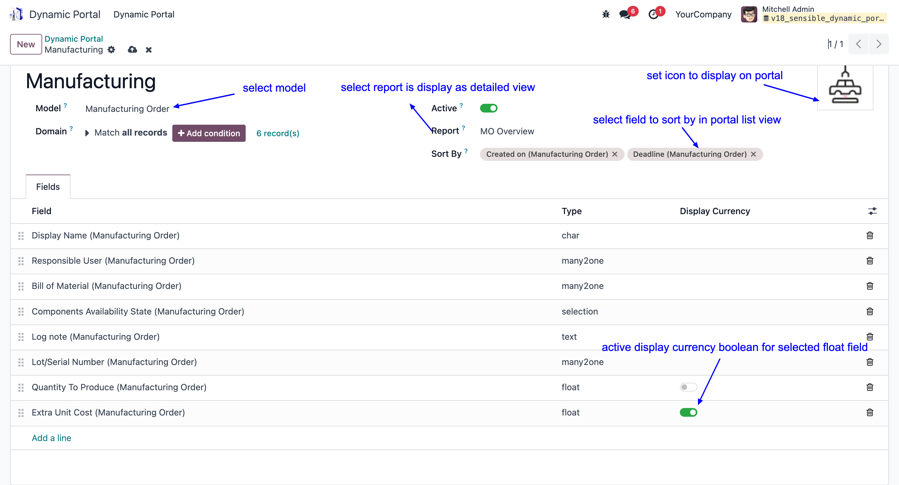
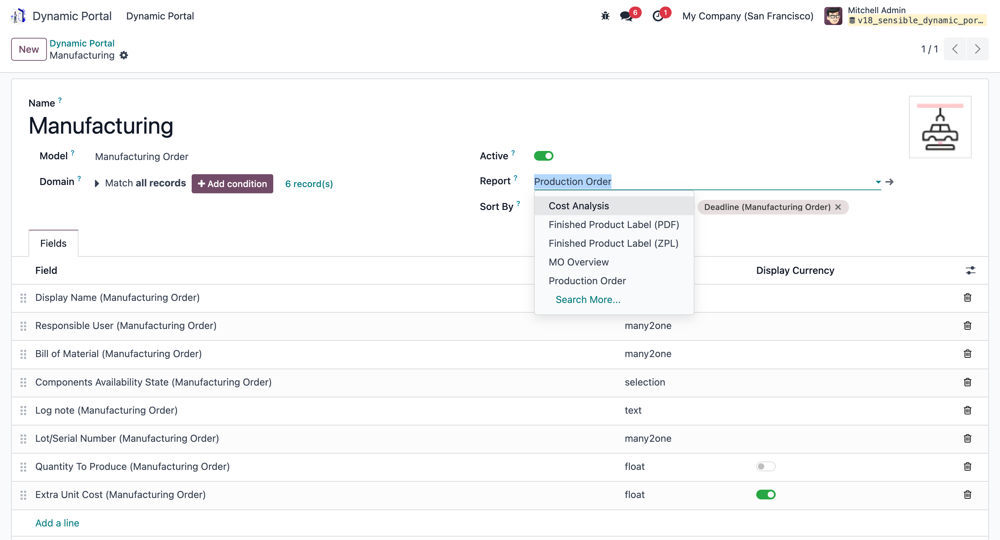

 Kindly ensure that the portal user has been granted the appropriate access rights
 
 It is highly recommended to use record rules for granting access to specific records based on the portal user's permissions. This approach ensures secure and organized access management

 

 - Configure report for detail view
